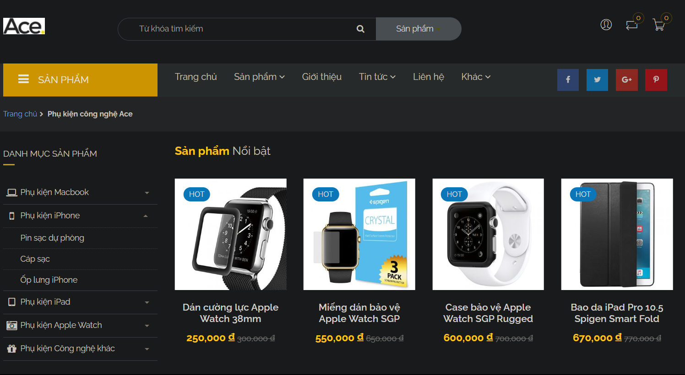
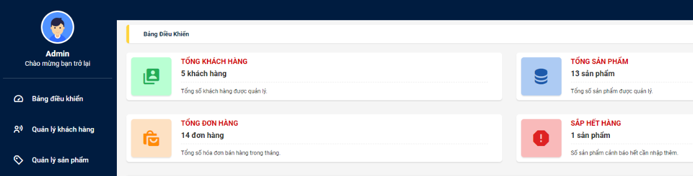
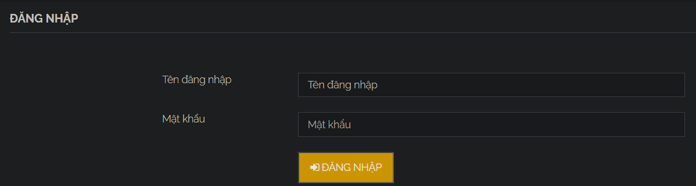
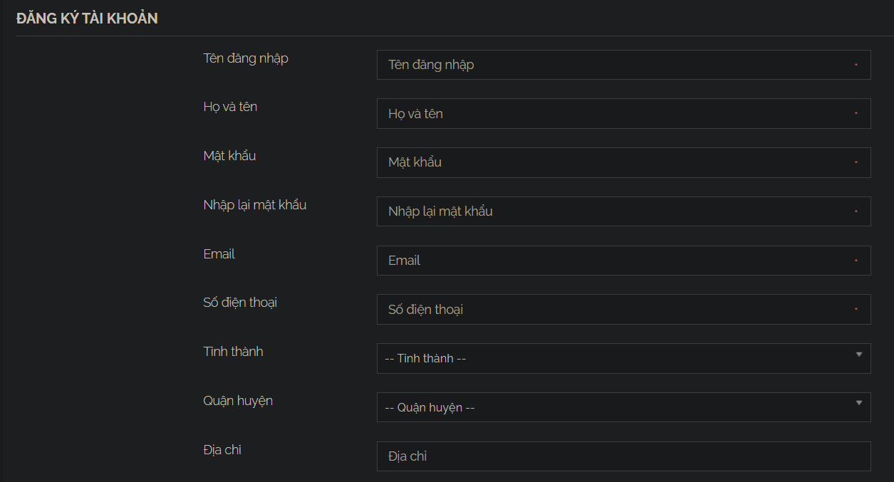
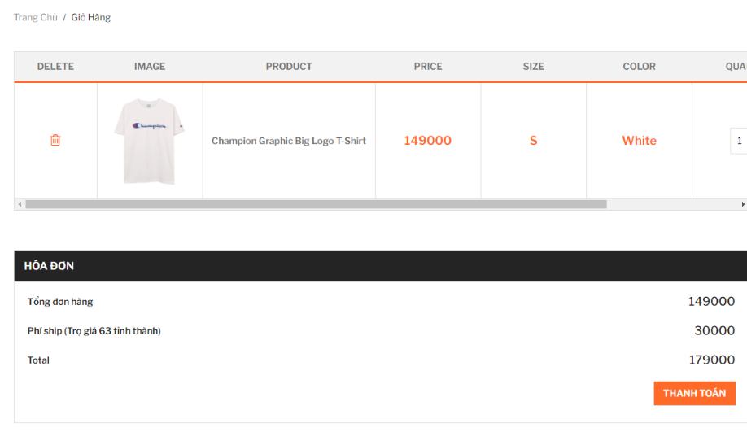

# Mavie Shop Project (Group 9)
*This is a website that introduces and sells mobile phones and related electronic devices. Customers can register an account and manage their shopping cart. Admin can manage customer lists and orders.* 

## Project Members
- 12 - Nguyễn Hoàng Tú - SE160539

## Technology
- HTML
- JavaScript
- SQL Server

## Main features
- Log in /Log out
- Register
- Manage orders /customers /orders
- Cart
- Purchase
- Account Management

## GUIs
- Home Page  

- Admin Page  

- Login Page  

- Register Page  

- Cart Management Page  
 
